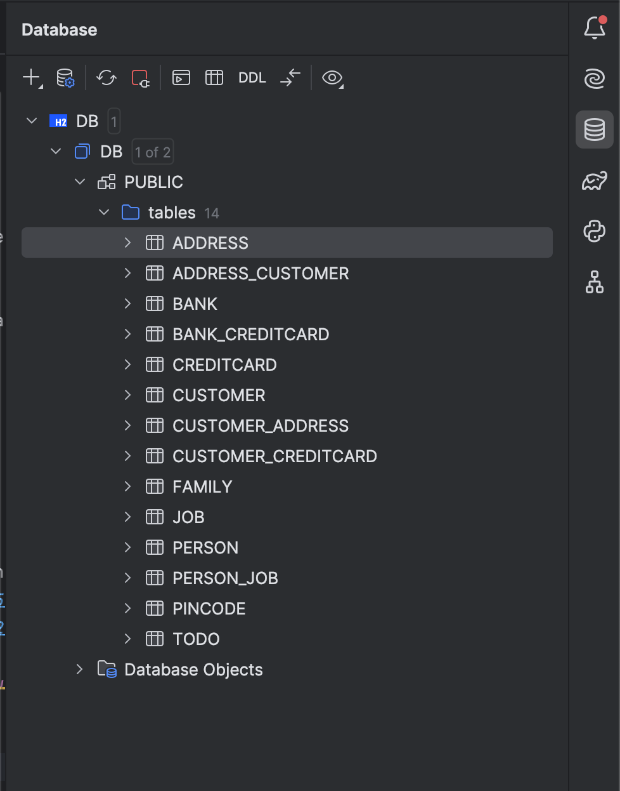

# Expass 4
_**Thea Jenny E. Kolnes**_

* Explain the used database and how/when it runs.
  * From the `persistence.xml` file, one can tell that the database used is an H2 relational database. The database runs after the application has started and everything is stored in `DB.mv.db`.
* Can you provide the SQL used to create the table Customer?
  * ```sql
    CREATE table customer (
    id BIGINT AUTO_INCREMENT PRIMARY KEY,
    name VARCHAR(255),
    );
    ```
* Find a way to inspect the database tables being created and create a database schema in your report. Do the created tables correspond to your initial thoughts regarding the exercise?
  * See screenshot below!
  * By using the Database Tools and SQL plugin in IntelliJ, I can inspect the database tables created and stored in `DB.mv.db`. The database does indeed correspond with my initial thoughts about how it would look. 

### Technical problems that you encountered during the completion of the tutorial
For experiment 1 I had to update some of the imports that the given `JpaTest.java` had, because some of it was outdated.
* `Before` --> `BeforeEach`
* assertEquals
* @Test(expected)
Some time later I noticed that the forked repository was actually updated to fit the JUnit version. 

For experiment 2 I didn't have any particular technical problems.

### Link to your code for experiment 2 above. Make sure the included test case passes!
* [The original repository](https://github.com/webminz/dat250-jpa-tutorial/tree/master?tab=readme-ov-file) that was forked from.
* [Experiment 2 classes](https://github.com/tjekol/dat250-jpa-tutorial/tree/master/src/main/java/no/hvl/dat250/jpa/tutorial/creditcards)
* [Test for credit cards](https://github.com/tjekol/dat250-jpa-tutorial/blob/master/src/test/java/no/hvl/dat250/jpa/tutorial/creditcards/driver/CreditCardsMainTest.java)

### An explanation of how you inspected the database tables and what tables were created. For the latter, you may provide screenshots.


### Any pending issues with this assignment which you did not manage to solve
No pending issues.
